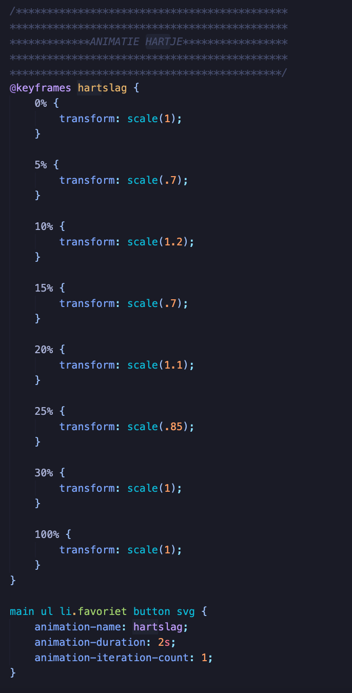

# Procesverslag
**Auteur:** -Yeliz Erbas-

**De opdrachten:** [opdracht 1](opdracht1/index.html) en [opdracht 2](opdracht2/index.html)

## Bronnenlijst
  1. https://developer.mozilla.org/en-US/docs/Web/CSS/CSS_Images/Using_CSS_gradients

## Opdracht 1 plan

  
uitwerken na schetsen idee (voor week 2)

  ### Je storyboard:
  

  ### Je ambitie: 
  Aan deze technieken/punten wil ik werken:
  - Een animatie goed in elkaar laten verlopen
  - Kijken of ik een 'plaatje' maken in css met gradients en niet een png gebruiken
 

## Opdracht 1 reflectie

  
uitwerken bij afronden opdracht (voor week 4)

  ### Je uitkomst - karakteristiek screenshot(s):
  
  

  ### Dit ging goed/Heb ik geleerd: 
  Het was even inkomen in het begin van de opdracht om weer aan de slag te gaan met animatie, maar het is mij gelukt om mijn idee na te kunnen maken. Ik heb wel de storyboard tijdens het maken een beetje aangepast. Het vizier komt namelijk van beneden i.p.v links, dat vond ik wat realistischer. Ik ben erg blij met het eindresultaat. Ik heb best veel geleerd over gradients en hoe je daar mee te werk kunt gaan. Voor deze opdracht was mijn voornaamste doel om gradients beter te begrijpen, en dat is gelukt. Daar ben ik enorm blij mee.

  

  ### Dit was lastig:
  Het maken van de vizier was wat lastiger, maar uiteindelijk is het wel gelukt en daar ben ik super trots op. Ik had er namelijk niet echt eerder wat mee gedaan, maar mijn wiskunde skills hebben mij niet in de steek gelaten, dus is het goed gekomen :) 

  

## Opdracht 2 plan

  
uitwerken na schetsen idee (voor week 4)

  ### Je ontwerp:
  
    

  ### Je ambitie: 
  Aan deze technieken/punten wil ik werken:
  - Werken met breakpoints
  - Beter worden in responsive coderen
  - verschillende interacties kunnen toevoegen

## Opdracht 2 reflectie

  
uitwerken bij afronden opdracht (voor week 8)

  ### Je uitkomst - karakteristiek screenshot(s):
  

  ### Dit ging goed/Heb ik geleerd: 
  Werken met breakpoitns ging erg goed. Ik had het nooit eerder gedaan, dus het was even nieuw, maar nu heb ik het wel onder de knie. Ik vind responsive design best lastig. Dus ik heb hier echt super veel van geleerd, waar ik erg blij mee ben :) Ik heb een breakpoint gemaakt voor de telefoon, ipad en desktop+. Zo wilde ik er voor zorgen dat alles een fijne interface had. In de breakpoints heb ik alle specifieke dingen gezet, zoals fontsizes en grids etc. Buiten de beakpoints heb ik alle algemene dingen gezet die golden voor alles. 

  
  
  

  Voor de herkasing heb ik ook met betere selectoren geprobeerd te werken. Hiervoor was het best troepig en niet zo heel consistent. Dit heb ik geprobeerd beter aan te pakken. Zo wilde ik het duidelijker maken voor mijzelf.

  
  

  ### Dit was lastig/Is niet gelukt:
  Sinds de herkansing heb ik veel dingen extra kunnnen toevoegen. Ik had graag een microinteractie willen toevoegen op het verwijderen van de films met een fadeout animatie.
  
  

   Dit is helaas niet gelukt. De animatie zou dan alleen moeten lopen als je op de verwijderknop zou drukken. Ik weet niet zo goed hoe je iets anders moet animeren buiten het knopje zelf om. Ik heb bijvoorbeeld wel een animatie bij de hartjesknoppen. Maar dit is alleen om de knop zelf te animeren en niet iets anders d.m.v een knop. Dit is iets wat ik in de toekomst nog wel zou willen leren.

   

